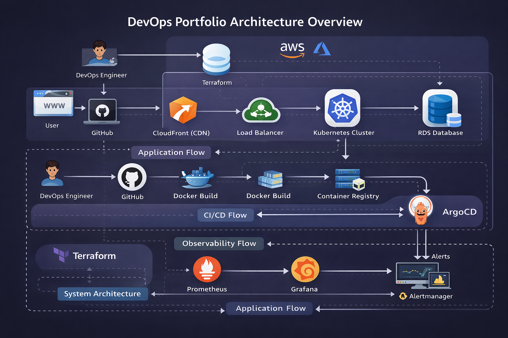

# 🚀 DevOps Portfolio — Production-Grade Platform Engineering

DevOps Engineer specializing in **Kubernetes, AWS, and GitOps-driven platform engineering**.

This portfolio demonstrates **end-to-end DevOps system design**, covering:

- Microservices architectures
- Kubernetes orchestration (k3s & EKS)
- CI/CD and GitOps workflows
- Infrastructure as Code (Terraform)
- Observability and monitoring systems

⚡ Focus: Building **scalable, production-ready cloud-native platforms**, not isolated demos.

---

# 🧱 System Architecture Overview

This portfolio represents a complete DevOps ecosystem:

- Containerized microservices (Docker)
- Kubernetes orchestration (k3s, EKS)
- CI/CD pipelines (GitHub Actions)
- GitOps deployments (ArgoCD)
- Infrastructure provisioning (Terraform)
- Monitoring (Prometheus, Grafana)

📌 These components work together to simulate a real-world production environment.

---

# 🔄 System Flow

### 🌐 Application Flow
User → CloudFront (CDN) → Load Balancer → Kubernetes Cluster → Microservices → Database (RDS)

### ⚙️ CI/CD Flow
Developer → GitHub → GitHub Actions → Docker Build → Container Registry → Kubernetes Deployment (ArgoCD)

### 📊 Observability Flow
Application → Prometheus → Grafana Dashboards → Alertmanager

---

# 📦 Core Platform Projects
These projects are interconnected and represent different layers of a production-grade DevOps ecosystem.

## 🔹 1. Emart DevOps Platform (Flagship Project)

**End-to-End DevOps Platform on Kubernetes using GitOps**

* Kubernetes (k3s), ArgoCD, GitHub Actions
* Microservices-based e-commerce system
* Integrated observability and deployment automation

### 🔥 Highlights

* Implemented **GitOps workflow using ArgoCD**
* Built **automated CI/CD pipelines**
* Deployed **microservices architecture on Kubernetes**
* Integrated **monitoring and alerting stack**

👉 Repositories:
- [emart-devops-platform](https://github.com/josephmj0303/emart-devops-platform)
- [emart-gitops](https://github.com/josephmj0303/emart-gitops)

---

## 🔹 2. AWS EKS .NET Microservices Platform

**Enterprise-grade Kubernetes deployment on AWS**

* Amazon EKS, Terraform, Docker, GitHub Actions
* ASP.NET Core microservices

### 🔥 Highlights

* Provisioned infrastructure using **Terraform**
* Deployed microservices on **EKS cluster**
* Built **fully automated CI/CD pipelines**
* Used **ECR for container registry**

👉 Repository: 
- [aws-eks-dotnet-microservices-platform](https://github.com/josephmj0303/aws-eks-dotnet-microservices-platform)

---

## 🔹 3. AWS Cloud-Native E-Commerce Platform

**Highly Available & Scalable AWS Architecture**

* S3, CloudFront, ALB, Auto Scaling, EC2, RDS (PostgreSQL)

### 🔥 Highlights

* Designed **high availability architecture**
* Implemented **auto-scaling backend infrastructure**
* Optimized **content delivery using CloudFront**
* Used **managed database services (RDS)**

👉 Repository: 
- [aws-cloud-native-ecommerce-platform](https://github.com/josephmj0303/aws-cloud-native-ecommerce-platform)

---

## 🔹 4. VProfile GitOps EKS Platform

**Full GitOps + IaC Implementation**

* Terraform, Helm, ArgoCD, GitHub Actions, EKS

### 🔥 Highlights

* Split architecture into:

  * Infrastructure (Terraform)
  * Application deployment (GitOps)
* Implemented **Helm-based deployments**
* Built **complete GitOps lifecycle**

👉 Repositories:

* [vprofile-gitops-eks-platform](https://github.com/josephmj0303/vprofile-gitops-eks-platform)
* [vprofile-gitops-app-deploy](https://github.com/josephmj0303/vprofile-gitops-app-deploy)
* [vprofile-gitops-iac](https://github.com/josephmj0303/vprofile-gitops-iac)

---

## 🔹 5. Monitoring & Observability Stack

**Production-grade monitoring system**

* Prometheus, Grafana, Alertmanager
* Python Flask application instrumentation

### 🔥 Highlights

* Implemented **metrics collection and visualization**
* Configured **alerting system**
* Designed **dashboard for real-time monitoring**

👉 Repository: 
- [monitoring-and-observability](https://github.com/josephmj0303/monitoring-and-observability)

---

# ⚡ Additional Projects

### 🔸 Emart Microservices Docker Deployment

* Docker Compose-based microservices setup
* Nginx reverse proxy
  👉 [emart-microservices-docker](https://github.com/josephmj0303/emart-microservices-docker)

---

### 🔸 Azure DevOps E-Commerce Platform

* Migration to **Azure PaaS architecture**
* Demonstrates **multi-cloud capability**
  👉 [ecommerce-azure-devops-platform](https://github.com/josephmj0303/ecommerce-azure-devops-platform)

---

### 🔸 AWS CI/CD with Elastic Beanstalk

* CodePipeline, CodeBuild, S3, RDS
  👉 [aws-cicd-elasticbeanstalk](https://github.com/josephmj0303/aws-cicd-elasticbeanstalk)

---

# 🧠 Production Practices Implemented

- Infrastructure as Code using Terraform
- GitOps-based continuous delivery (ArgoCD)
- Automated CI/CD pipelines (GitHub Actions)
- Horizontal scaling via Kubernetes
- High availability architecture (multi-AZ, load balancing)
- Observability with metrics, dashboards, and alerting
- Secure configuration management (IAM, env-based configs)

---

# 🏛️ Key Engineering Highlights

- Designed and deployed **microservices-based platforms on Kubernetes**
- Implemented **GitOps workflows for automated deployments**
- Built **fully automated CI/CD pipelines across multiple environments**
- Provisioned **cloud infrastructure using Terraform**
- Integrated **end-to-end observability stack**
- Demonstrated **multi-cloud capability (AWS + Azure)**

---

# 🔄 DevOps Maturity Evolution

| Stage        | Implementation                        |
|--------------|---------------------------------------|
| Traditional  | VM-based deployments (EC2)            |
| Containerized| Docker-based microservices            |
| Orchestrated | Kubernetes (k3s, EKS)                 |
| Automated    | CI/CD pipelines (GitHub Actions)      |
| GitOps       | ArgoCD-based deployments              |
| Observable   | Prometheus + Grafana + Alertmanager   |

---

# 📎 Resume

📄 Available in `/resume` directory

---

# 📬 Contact

* GitHub: https://github.com/josephmj0303
* LinkedIn: *(Add your profile link here)*

---

# ⭐ Final Note

This portfolio represents **hands-on DevOps engineering experience**, focusing on building **real-world, production-style systems** rather than isolated demos.

It reflects my ability to:

* Design scalable architectures
* Automate infrastructure and deployments
* Operate and monitor distributed systems

---

⭐ If you find this portfolio valuable, feel free to explore the repositories and connect!

